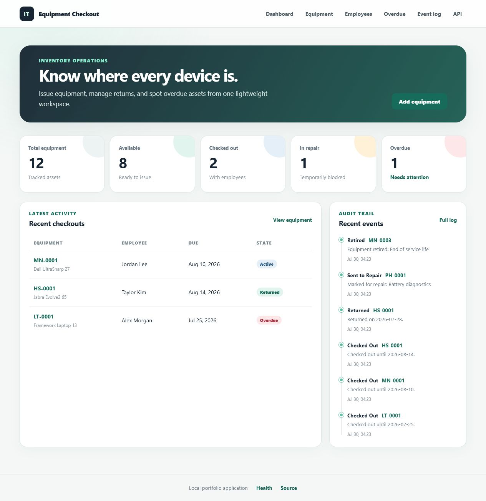
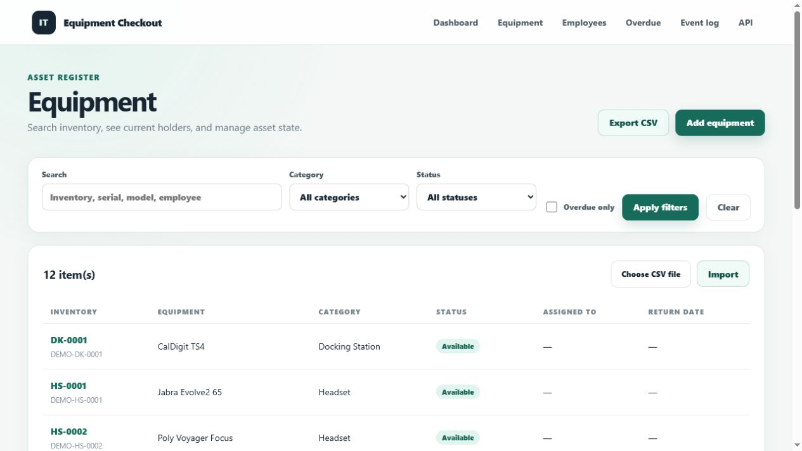
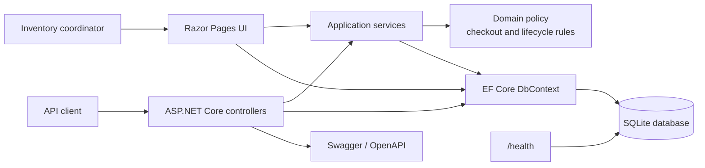
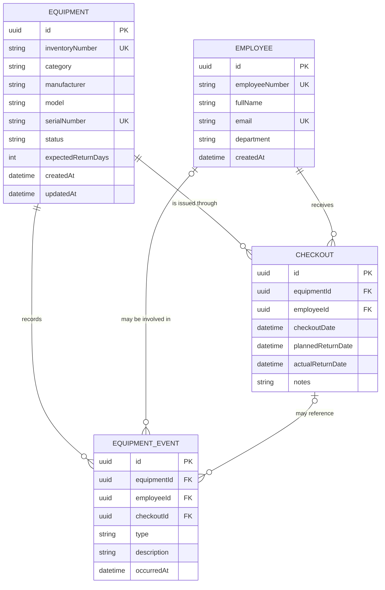

# IT Equipment Checkout

[](https://github.com/German4341374/it-equipment-checkout/actions/workflows/ci.yml)
[](LICENSE)
[](global.json)

A small app for lending out laptops, monitors, headsets, and other equipment.
Record who took an item and when it's due back, then mark it returned when it comes in.
The app stops the same item being checked out twice and highlights overdue returns.

It has a web interface, a REST API, and CSV import and export. There are no user accounts
or access roles, so keep it on a trusted local network.

## Features

- Register equipment and employees.
- Check out equipment with an explicit or policy-derived planned return date.
- Return equipment while preserving a complete checkout history.
- Prevent a second active checkout for the same asset.
- Block `Repair` and `Retired` equipment from checkout.
- Move equipment through `Available`, `Checked Out`, `Repair`, and `Retired` states.
- Search by inventory number, serial number, model, manufacturer, or employee.
- Filter by category, status, and overdue state.
- Review overdue returns, dashboard totals, and an immutable equipment event log.
- Import and export equipment as CSV.
- Use the same business workflows through Razor Pages or the REST API.
- Inspect OpenAPI documentation at `/swagger` and health at `/health`.

## Screenshots

### Dashboard



### Equipment register



## User scenarios

1. **Receive a device:** an inventory coordinator adds a laptop with unique inventory and serial numbers.
2. **Issue a device:** the coordinator selects an available device and an employee. If no date is supplied, the equipment's `expectedReturnDays` policy determines the due date.
3. **Prevent conflicts:** an attempt to check out an already issued, retired, or repair asset returns an HTTP `409` Problem Details response.
4. **Return a device:** the active checkout receives an actual return date and the equipment becomes available.
5. **Send for repair:** only an available device can enter repair; returning it from repair makes it available again.
6. **Follow up overdue items:** the dashboard and overdue view highlight active checkouts whose planned return date has passed.
7. **Audit changes:** every create, update, checkout, return, repair, retirement, and import action is recorded as an equipment event.

## Architecture



The solution separates pure domain behavior from web and persistence concerns:

- `ItEquipmentCheckout.Core` contains entities, enums, and business rules without ASP.NET Core or EF Core dependencies.
- `ItEquipmentCheckout.Web` contains EF Core mappings, application services, DTOs, API controllers, Razor Pages, migrations, seed data, and health checks.
- `ItEquipmentCheckout.UnitTests` exercises domain rules in memory.
- `ItEquipmentCheckout.IntegrationTests` starts the complete application with a temporary SQLite database and calls the HTTP API.

More detail is available in [docs/architecture.md](docs/architecture.md).

## Data model



SQLite constraints reinforce the application rules. Inventory numbers and serial numbers are case-insensitively unique, and a partial unique index allows only one checkout with `ActualReturnDate IS NULL` per equipment item.

## Technology

- .NET 10 LTS and ASP.NET Core
- Entity Framework Core 10 with SQLite
- Razor Pages, HTML, and CSS
- Swagger/OpenAPI through Swashbuckle
- xUnit with `WebApplicationFactory`
- Docker and Docker Compose
- GitHub Actions, Dependabot, and Trivy

Important NuGet dependencies, the .NET SDK, GitHub Actions, and both container base images are pinned. NuGet lock files make restore reproducible.

## Prerequisites

Choose one workflow:

- Local: .NET SDK `10.0.302` and optionally GNU Make.
- Container: Docker Engine 24+ with Docker Compose v2.

Windows users can run the commands from PowerShell or WSL2. Docker Desktop must be configured for Linux containers when using Windows.

## Run locally

```bash
git clone https://github.com/German4341374/it-equipment-checkout.git
cd it-equipment-checkout
dotnet tool restore
dotnet restore ItEquipmentCheckout.slnx --locked-mode
dotnet run --project src/ItEquipmentCheckout.Web
```

Open:

- Web UI: `http://localhost:5000` or the URL printed by ASP.NET Core
- Swagger: `/swagger`
- Health: `/health`

The application applies committed EF Core migrations at startup and inserts deterministic demo data only when the database is empty. The local SQLite file is stored under `src/ItEquipmentCheckout.Web/Data/` and is ignored by Git.

To use a different database location:

```bash
ConnectionStrings__CheckoutDatabase="Data Source=/tmp/checkout.db" \
  dotnet run --project src/ItEquipmentCheckout.Web
```

In PowerShell:

```powershell
$env:ConnectionStrings__CheckoutDatabase = "Data Source=$PWD\checkout.db"
dotnet run --project src/ItEquipmentCheckout.Web
```

## Run with Docker

```bash
docker compose up --build --detach
docker compose ps
curl --fail http://localhost:8080/health
```

Open `http://localhost:8080`. SQLite data is persisted in the named volume `checkout_data`.

```bash
docker compose logs --follow app
docker compose down
```

Use `docker compose down --volumes` only when you intentionally want to delete local application data.

The runtime container uses a non-root user, drops Linux capabilities, enables `no-new-privileges`, uses a read-only root filesystem, and writes only to its data volume and a small temporary filesystem.

## REST API

| Method | Route | Purpose |
|---|---|---|
| `GET`, `POST` | `/api/equipment` | Search/list or create equipment |
| `GET`, `PUT` | `/api/equipment/{id}` | Read or update equipment |
| `POST` | `/api/equipment/{id}/repair` | Move an available item to repair |
| `POST` | `/api/equipment/{id}/available` | Return an item from repair |
| `POST` | `/api/equipment/{id}/retire` | Retire an available item |
| `GET`, `POST` | `/api/equipment/export`, `/api/equipment/import` | CSV export/import |
| `GET`, `POST` | `/api/employees` | Search/list or create employees |
| `GET`, `PUT` | `/api/employees/{id}` | Read or update an employee |
| `GET`, `POST` | `/api/checkouts` | Filter/list or create checkouts |
| `GET` | `/api/checkouts/{id}` | Read checkout details |
| `POST` | `/api/checkouts/{id}/return` | Return a checkout |
| `GET` | `/api/events` | Filter the audit event stream |
| `GET` | `/api/dashboard` | Read summary metrics |
| `GET` | `/health` | Check application and database health |

### Create equipment

```bash
curl --request POST http://localhost:8080/api/equipment \
  --header "Content-Type: application/json" \
  --data '{
    "inventoryNumber": "LT-1042",
    "category": "Laptop",
    "manufacturer": "Framework",
    "model": "Laptop 13",
    "serialNumber": "DEMO-LT-1042",
    "expectedReturnDays": 30
  }'
```

### Create an employee

```bash
curl --request POST http://localhost:8080/api/employees \
  --header "Content-Type: application/json" \
  --data '{
    "employeeNumber": "EMP-1042",
    "fullName": "Casey Rivera",
    "email": "casey.rivera@example.test",
    "department": "Support"
  }'
```

### Check out and return equipment

Use the `id` values from the create responses:

```bash
curl --request POST http://localhost:8080/api/checkouts \
  --header "Content-Type: application/json" \
  --data '{
    "equipmentId": "00000000-0000-0000-0000-000000000000",
    "employeeId": "00000000-0000-0000-0000-000000000000",
    "plannedReturnDate": "2026-08-31T00:00:00Z",
    "notes": "Temporary replacement device"
  }'

curl --request POST \
  http://localhost:8080/api/checkouts/00000000-0000-0000-0000-000000000000/return \
  --header "Content-Type: application/json" \
  --data '{"actualReturnDate":"2026-08-20T10:30:00Z"}'
```

Validation errors, missing resources, rule conflicts, and database uniqueness conflicts use the RFC 7807 Problem Details JSON format.

## CSV import and export

The expected import header is:

```text
inventoryNumber,category,manufacturer,model,serialNumber,expectedReturnDays
```

An example is provided at [examples/equipment.csv](examples/equipment.csv). Import accepts at most 1,000 data rows and 2 MiB per request. Invalid rows are rejected with row-level messages while valid rows are imported. Export prefixes spreadsheet-formula characters and uses UTF-8 with a BOM.

```bash
curl --request POST http://localhost:8080/api/equipment/import \
  --form "file=@examples/equipment.csv"

curl --output equipment.csv http://localhost:8080/api/equipment/export
```

## Testing and verification

```bash
make setup
make lint
make test
make build
```

Without Make:

```bash
dotnet tool restore
dotnet restore ItEquipmentCheckout.slnx --locked-mode
dotnet format ItEquipmentCheckout.slnx --verify-no-changes --no-restore
dotnet build ItEquipmentCheckout.slnx --configuration Release --no-restore
dotnet test ItEquipmentCheckout.slnx --configuration Release --no-build --no-restore
dotnet ef migrations has-pending-model-changes \
  --project src/ItEquipmentCheckout.Web \
  --startup-project src/ItEquipmentCheckout.Web \
  --no-build --configuration Release
dotnet list ItEquipmentCheckout.slnx package --vulnerable --include-transitive
```

The integration suite creates an isolated temporary SQLite database, applies real migrations, calls the application through HTTP, and removes the database after each test class.

## CI/CD

The [CI workflow](.github/workflows/ci.yml) runs on pushes and pull requests to `main`:

- locked dependency restore with cache;
- formatting verification and compiler/analyzer checks;
- Release build;
- unit and integration tests with coverage artifacts;
- EF Core pending-model-change check;
- NuGet vulnerability audit;
- multi-stage container build;
- Trivy scan for fixable high and critical image vulnerabilities.

The workflow has read-only repository permissions, pinned action commits, concurrency cancellation, explicit timeouts, and never publishes or deploys an image. Dependabot proposes weekly NuGet, Docker, and GitHub Actions updates.

## Security considerations

- This application has **no authentication or authorization**. Do not expose it directly to the public internet.
- Run it on a trusted workstation or private network, or place it behind an authenticated reverse proxy.
- SQLite is appropriate for a small single-instance deployment, not multiple concurrent application replicas.
- API inputs use DTO validation; domain services enforce lifecycle rules; database constraints defend uniqueness and active-checkout invariants.
- No credentials or personal data are committed. Seed identities use the reserved `example.test` domain.
- CSV import is size- and row-limited; CSV export mitigates spreadsheet formula injection.
- The health endpoint intentionally exposes only aggregate component status.

Please report vulnerabilities according to [SECURITY.md](SECURITY.md).

## Limitations

- No authentication, roles, or user-specific permissions.
- No reservation queue, notifications, barcode scanner integration, or attachments.
- No pagination; list endpoints are designed for a small inventory.
- Audit events are application-managed rather than database-triggered.
- Startup migrations are convenient for a single local instance; larger deployments should run migrations as a separate release step.
- SQLite allows only one write transaction at a time and is not intended for horizontal scaling.

## Possible next steps

- Add cursor pagination and richer sorting.
- Add optimistic concurrency tokens to edit workflows.
- Provide barcode/QR label generation.
- Add a PostgreSQL deployment profile for larger inventories.
- Introduce authenticated access through an external identity-aware proxy.
- Add accessibility automation and browser end-to-end tests.
- Publish versioned OCI images after a signed release workflow is introduced.

## Contributing

See [CONTRIBUTING.md](CONTRIBUTING.md). Commits follow the Conventional Commits specification, for example:

```text
feat(api): add equipment lifecycle endpoint
fix(checkout): reject a return before checkout date
test(api): cover CSV round trip
```

## License

Licensed under the [MIT License](LICENSE).
