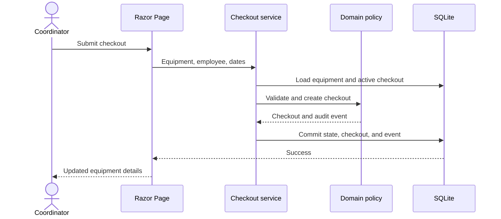

# Architecture notes

## Context

The application supports a small equipment inventory managed by one trusted internal team. It needs a visual interface, an automation-friendly API, persistent history, and strong checkout invariants without the operational overhead of a distributed system.

## Decisions

### Modular monolith

The system is one deployable ASP.NET Core process. Razor Pages and API controllers share the same application services and EF Core context. The `Core` project remains free of framework dependencies so domain rules can be tested quickly.

This is simpler to operate than separate UI and API services, while the project boundary still prevents business rules from becoming controller-specific.

### SQLite persistence

SQLite requires no database server and keeps the demonstration fully local. EF Core migrations make schema evolution explicit. A named Docker volume persists the database across container replacement.

The trade-off is limited write concurrency and no horizontal application scaling. PostgreSQL would be a better fit for a larger multi-user deployment.

### Defense-in-depth rules

The domain policy rejects invalid lifecycle transitions. EF Core and SQLite add:

- case-insensitive unique indexes for inventory and serial numbers;
- a partial unique index for one active checkout per equipment item;
- check constraints for date ordering and positive expected return days;
- required foreign keys for checkout ownership.

The application catches expected rule and constraint failures and returns consistent Problem Details responses.

### Application-managed event log

Lifecycle services append `EquipmentEvent` records in the same database transaction as the state change. This keeps the event descriptions useful to operators and makes the UI timeline straightforward.

The trade-off is that out-of-band database writes are not audited. A production environment that permits direct database changes should use stricter database access and potentially an audit trigger.

### Startup migrations

The application applies committed migrations before accepting traffic. This is convenient and safe for a single local instance. Multi-replica deployments should use a dedicated migration job to avoid coordinating concurrent startup.

### No built-in authentication

Authentication is deliberately outside this project's scope. This keeps attention on inventory workflows and makes the local demo frictionless. The application must remain private or be protected by an authenticated reverse proxy.

## Request flow

